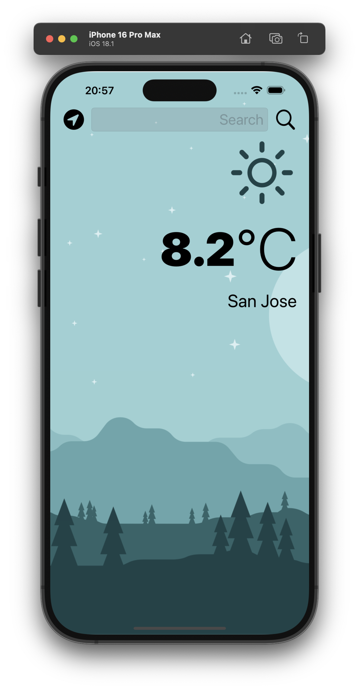

# 🌤️ Clima - iOS Weather App

Clima is a beautiful weather app built for iOS that displays real-time weather conditions for any city or the user's current location. The app uses the OpenWeatherMap API to fetch data and includes features like dark/light mode adaptation, location-based weather, and dynamic animations for an enhanced user experience.

---

## 📸 Screenshots

### Light Mode:


### Dark Mode:


---

## ✨ Features

- **Real-Time Weather Updates:** Get live weather updates based on your current location or search by city name.
- **Dynamic Weather Animations:** Visualize the weather with beautiful animations for rain, snow, clouds, and sunshine.
- **Dark & Light Mode:** The app adapts to the system's light or dark mode for a seamless experience.
- **Temperature in Celsius:** Displays temperature in a user-friendly format.
- **Error Handling:** Alerts users if there are network issues or invalid city searches.

---

## 🔧 Installation

1. Clone this repository:
   ```bash
   git clone https://github.com/anshusinha26/Clima-iOS-WeatherApp.git
